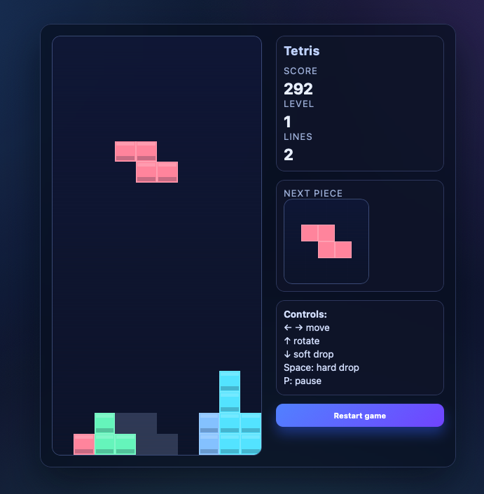

# Tetris JavaScript

A Tetris clone built in a single HTML file using JavaScript and Canvas rendering. You can play the game live here: https://juancruzlunatech.github.io/Tetris_single_File_JavaScript/



## Description

This project recreates the classic Tetris mechanics with:
- pieces that fall continuously,
- horizontal movement and rotation,
- full-line clearing,
- score, level, and line tracking,
- keyboard controls and a touch-friendly version for mobile devices.
- a playable version available online at the GitHub Pages link above.

## Technologies used

- HTML5: page structure and game board canvas.
- CSS3: visual design, responsive layout, and modern styling.
- JavaScript: game logic, gravity, collisions, rotation, scoring, and controls.
- Canvas API: drawing the board, falling pieces, next-piece preview, and visual effects.
- No external dependencies: it does not require frameworks or libraries.

## How to run

1. Open the `index.html` file in your browser.
2. Alternatively, you can serve the folder locally with a simple web server, for example:

```bash
python -m http.server 8000
```

Then visit `http://localhost:8000`.

## Controls

- Left / Right arrow: move piece
- Up arrow: rotate piece
- Down arrow: soft drop
- Space: hard drop
- P: pause the game

## Goal

Complete lines to earn points, level up, and prevent the pieces from reaching the top of the board.
